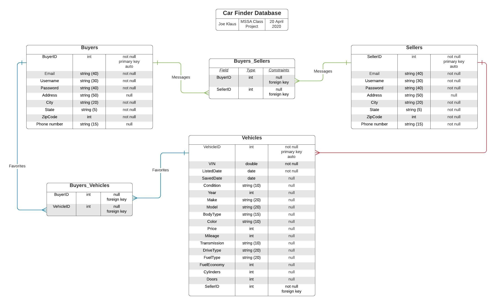

# Car Finder Database

## Phyical Database Design



Above is the design for the CarFinder database. It consists of a Sellers table, a Users table, and a Vehicles table, and demonstrates the relationships between them.

### Create the Database

```sql
USE master;
GO

DROP DATABASE IF EXISTS CarFinderDb;
GO

CREATE DATABASE CarFinderDb;
GO

USE CarFinderDb;
GO
```

### Create the Buyers Table
This will store potential Buyers' usernames and passwords, along with basic contact information.

```sql
CREATE TABLE Buyers
(
	buyerid		INT			IDENTITY(1,1)	NOT NULL,
	email		NVARCHAR(40)				NOT NULL,
	username	NVARCHAR(30)				NOT NULL,
	password	NVARCHAR(40)				NOT NULL,
	address		NVARCHAR(50)				    NULL,
	city		NVARCHAR(20)				NOT NULL,
	state		NVARCHAR(5)				NOT NULL,
	zipcode		INT					NOT NULL,
	phonenumber NVARCHAR(15)				    NULL,
	CONSTRAINT PK_Buyers PRIMARY KEY (buyerid),
	CONSTRAINT UC_Email UNIQUE (email)
);
GO
```

### Create the Sellers Table
This will store potential Sellers' usernames and passwords, along with basic contact information and the Vehicles they are listing on the application.

```sql
CREATE TABLE Sellers
(
	sellerid	INT			IDENTITY(1,1)	NOT NULL,
	email		NVARCHAR(40)				NOT NULL,
	username	NVARCHAR(30)				NOT NULL,
	password	NVARCHAR(40)				NOT NULL,
	address		NVARCHAR(50)				    NULL,
	city		NVARCHAR(20)				NOT NULL,
	state		NVARCHAR(5)				NOT NULL,
	zipcode		INT					NOT NULL,
	phonenumber NVARCHAR(15)				NOT NULL,
	CONSTRAINT PK_Sellers PRIMARY KEY (sellerid),
	CONSTRAINT UC_Email2 UNIQUE (email)
);
GO
```
### Create the Buyers_Sellers Table
This table is necessary due to the many-to-many relationships encompassed between the Buyers and Sellers Tables. When a Buyer contacts one or more Sellers regarding their Vehicles, it is logged in the database. Sellers can also contact Buyers, which also gets logged in the database.

```sql
CREATE TABLE Buyers_Sellers
(
	buyerid		INT		NULL,
	sellerid	INT		NULL,
	CONSTRAINT FK_Buyers_Sellers_Buyers FOREIGN KEY (buyerid)
		REFERENCES Sellers(sellerid),
	CONSTRAINT FK_Buyers_Sellers_Sellers FOREIGN KEY (sellerid)
	REFERENCES Buyers(buyerid)
);
GO
```
### Create the Vehicles Table
This table stores all of the listed Vehicles, along with their features, price, condition, their Seller, etc.

```sql
CREATE TABLE Vehicles
(
	vehicleid		INT			IDENTITY(1,1)	NOT NULL,
	VIN				NVARCHAR(20)			NOT NULL,
	listeddate		DATE					NOT NULL,
	saveddate		DATE					    NULL,
	condition		NVARCHAR(10)				    NULL,
	year			INT					    NULL,
	make			NVARCHAR(20)				    NULL,
	model			NVARCHAR(30)				    NULL,
	bodytype		NVARCHAR(15)				    NULL,
	color			NVARCHAR(10)				    NULL,
	price			INT					    NULL,
	mileage			INT					    NULL,
	transmission	NVARCHAR(10)					    NULL,
	drivetrain		NVARCHAR(10)				    NULL,
	fueltype		NVARCHAR(10)				    NULL,
	fueleconomy		INT					    NULL,
	cylinders		INT					    NULL,
	doors			INT					    NULL,
	sellerid		INT					NOT NULL,
	CONSTRAINT PK_Vehicles PRIMARY KEY (vehicleid)
	CONSTRAINT FK_Vehicles_Sellers FOREIGN KEY (sellerid)
	REFERENCES Sellers(sellerid)
);
GO
```
### Create the Buyers_Vehicles Table
This table is necessary due to the many-to-many relationships encompassed between the Buyers and Vehicles Tables. When a Buyer saves a Vehicle, it is logged in the database. Many Buyers can save a Vehicle, and many Vehicles may be saved by a Buyer.

```sql
CREATE TABLE Buyers_Vehicles
(
	buyerid		INT		NULL,
	vehicleid	INT		NULL,
	CONSTRAINT FK_Buyers_Vehicles_Buyers FOREIGN KEY (buyerid)
		REFERENCES Vehicles(vehicleid),
	CONSTRAINT FK_Buyers_Vehicles_Vehicles FOREIGN KEY (vehicleid)
	REFERENCES Buyers(buyerid)
);
GO
```
