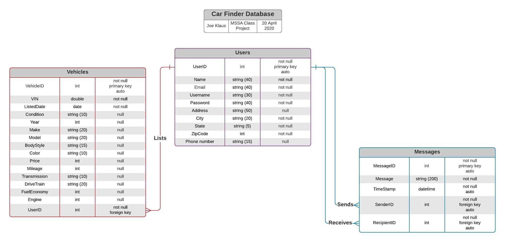

# Car Finder Database

## Physical Database Design



Above is the design for the CarFinder database. It consists of a Users table, a Messages table, and a Vehicles table, and demonstrates the relationships between them.

### Create the Database

```sql
USE master;
GO

DROP DATABASE IF EXISTS CarFinderDb;
GO

CREATE DATABASE CarFinderDb;
GO
```

### Create the Users Table
This will store users' basic account and contact information.

```sql
USE CarFinderDb;
GO

DROP TABLE IF EXISTS Users;
CREATE TABLE Users
(
	userid			INT			IDENTITY(1,1)	NOT NULL,
	email			NVARCHAR(40)				NOT NULL,
	username		NVARCHAR(30)				NOT NULL,
	password		NVARCHAR(40)				NOT NULL,
	address			NVARCHAR(50)				    NULL,
	city			NVARCHAR(20)				NOT NULL,
	state			NVARCHAR(5)				NOT NULL,
	zipcode			INT					NOT NULL,
	phonenumber NVARCHAR(15)				    	    NULL,

	CONSTRAINT PK_Users PRIMARY KEY (userid),
	CONSTRAINT UC_Email UNIQUE (email)
);
GO

```

### Create the Vehicles Table
This table stores all of the listed Vehicles, along with their features, price, condition, their seller, etc.

```sql
DROP TABLE IF EXISTS Vehicles;
CREATE TABLE Vehicles
(
	vehicleid		INT			IDENTITY(1,1)	NOT NULL,
	VIN				NVARCHAR(20)			NOT NULL,
	listeddate		DATE					NOT NULL,
	condition		NVARCHAR(10)				    NULL,
	year			INT					    NULL,
	make			NVARCHAR(20)				    NULL,
	model			NVARCHAR(30)				    NULL,
	bodystyle		NVARCHAR(15)				    NULL,
	color			NVARCHAR(10)				    NULL,
	price			INT					    NULL,
	mileage			INT					    NULL,
	transmission		NVARCHAR(10)				    NULL,
	drivetrain		NVARCHAR(10)				    NULL,
	fueleconomy		INT					    NULL,
	engine			INT					    NULL,
	userid			INT					NOT NULL,

	CONSTRAINT PK_Vehicles PRIMARY KEY (vehicleid),
	CONSTRAINT FK_Vehicles_Users FOREIGN KEY(userid)
      REFERENCES Users(userid)
);
GO

```
### Create the Messages Table
This table stores the messages sent between users, as well as when they were sent, who sent them, and who received them.

```sql
DROP TABLE IF EXISTS Messages;
CREATE TABLE Messages
(
	messageid		INT			IDENTITY(1,1)	NOT NULL,
	message			NVARCHAR(200)				NOT NULL,
	timestamp		DATETIME				NOT NULL,
	senderid		INT					NOT NULL,
	recipientid		INT					NOT NULL,

	CONSTRAINT PK_Messages PRIMARY KEY (messageid),
	CONSTRAINT FK_SentMessages_Users FOREIGN KEY(senderid)
      REFERENCES Users(userid),
	CONSTRAINT FK_ReceivedMessages_Users FOREIGN KEY(recipientid)
      REFERENCES Users(userid)
);
GO

```
