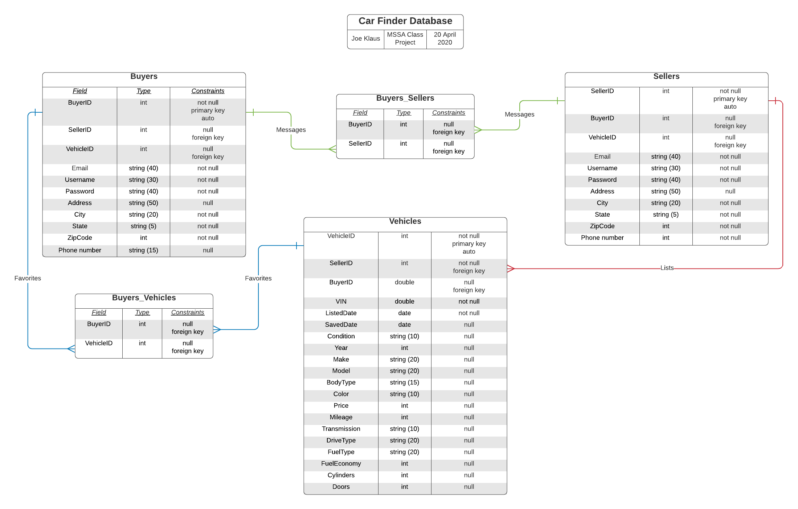

# Car Finder Database

## Phyical Database Design



### Create the Database

```sql
USE master;
GO

DROP DATABASE IF EXISTS CarFinderDb;
GO

CREATE DATABASE CarFinderDb;
GO

USE CarFinderDb;
GO
```

### Create the Tables

```sql
CREATE TABLE Buyers
(
	buyerid		INT			IDENTITY(1,1)	NOT NULL,
	email		NVARCHAR(40)				NOT NULL,
	username	NVARCHAR(30)				NOT NULL,
	password	NVARCHAR(40)				NOT NULL,
	address		NVARCHAR(50)				NULL,
	city		NVARCHAR(20)				NOT NULL,
	state		NVARCHAR(5)				NOT NULL,
	zipcode		INT					NOT NULL,
	phonenumber NVARCHAR(15)				NULL,
	CONSTRAINT PK_Buyers PRIMARY KEY (buyerid),
	CONSTRAINT UC_Email UNIQUE (email)
);
GO

CREATE TABLE Sellers
(
	sellerid	INT			IDENTITY(1,1)	NOT NULL,
	email		NVARCHAR(40)				NOT NULL,
	username	NVARCHAR(30)				NOT NULL,
	password	NVARCHAR(40)				NOT NULL,
	address		NVARCHAR(50)				NULL,
	city		NVARCHAR(20)				NOT NULL,
	state		NVARCHAR(5)				NOT NULL,
	zipcode		INT					NOT NULL,
	phonenumber NVARCHAR(15)				NOT NULL,
	vehicleid	INT					NULL,
	CONSTRAINT PK_Sellers PRIMARY KEY (sellerid),
	CONSTRAINT UC_Email2 UNIQUE (email)
);
GO

CREATE TABLE Buyers_Sellers
(
	buyerid		INT		NULL,
	sellerid	INT		NULL,
	CONSTRAINT FK_Buyers_Sellers_Buyers FOREIGN KEY (buyerid)
		REFERENCES Sellers(sellerid),
	CONSTRAINT FK_Buyers_Sellers_Sellers FOREIGN KEY (sellerid)
	REFERENCES Buyers(buyerid)
);
GO

CREATE TABLE Vehicles
(
	vehicleid		INT			IDENTITY(1,1)	NOT NULL,
	VIN				NVARCHAR(20)			NOT NULL,
	listeddate		DATE					NOT NULL,
	saveddate		DATE					NULL,
	condition		NVARCHAR(10)				NULL,
	year			INT					NULL,
	make			NVARCHAR(20)				NULL,
	model			NVARCHAR(30)				NULL,
	bodytype		NVARCHAR(15)				NULL,
	color			NVARCHAR(10)				NULL,
	price			INT					NULL,
	mileage			INT					NULL,
	transmission	NVARCHAR(10)					NULL,
	drivetrain		NVARCHAR(10)				NULL,
	fueltype		NVARCHAR(10)				NULL,
	fueleconomy		INT					NULL,
	cylinders		INT					NULL,
	doors			INT					NULL,
	sellerid		INT					NOT NULL,
	CONSTRAINT PK_Vehicles PRIMARY KEY (vehicleid)
);
GO

CREATE TABLE Buyers_Vehicles
(
	buyerid		INT		NULL,
	vehicleid	INT		NULL,
	CONSTRAINT FK_Buyers_Vehicles_Buyers FOREIGN KEY (buyerid)
		REFERENCES Vehicles(vehicleid),
	CONSTRAINT FK_Buyers_Vehicles_Vehicles FOREIGN KEY (vehicleid)
	REFERENCES Buyers(buyerid)
);
GO
```

### Inserting Sample Data

```sql
INSERT INTO dbo.Buyers(email, username, password, address, city, state, zipcode, phonenumber)
VALUES
(N'buyer1@gmail.com', N'buyer1username', N'buyer1password', N'111 Buyer Street', N'BuyerVille', N'CO', 12345, N'111 111 1111'),
(N'buyer2@gmail.com', N'buyer2username', N'buyer2password', N'222 Buyer Street', N'BuyerVille', N'CO', 12435, N'222 222 2222'),
(N'buyer3@gmail.com', N'buyer3username', N'buyer3password', N'333 Buyer Street', N'BuyerVille', N'CO', 12345, N'333 333 3333'),
(N'buyer4@gmail.com', N'buyer4username', N'buyer4password', N'444 Buyer Street', N'BuyerVille', N'CO', 11332, N'444 444 4444'),
(N'buyer5@gmail.com', N'buyer5username', N'buyer5password', N'555 Buyer Street', N'BuyerVille', N'CO', 11332, N'555 555 5555');

INSERT INTO dbo.Sellers(vehicleid, email, username, password, address, city, state, zipcode, phonenumber)
VALUES
(2, N'seller1@gmail.com', N'seller1username', N'seller1password', N'111 Seller Street', N'SellerVille', N'CO', 12345, N'111 222 3333'),
(3, N'seller2@gmail.com', N'seller2username', N'seller2password', N'222 Seller Street', N'SellerVille', N'CO', 12435, N'222 333 4444'),
(4, N'seller3@gmail.com', N'seller3username', N'seller3password', N'333 Seller Street', N'SellerVille', N'CO', 12345, N'333 444 5555'),
(null, N'seller4@gmail.com', N'seller4username', N'seller4password', N'444 Seller Street', N'SellerVille', N'CO', 11332, N'444 555 6666'),
(5, 'seller5@gmail.com', N'seller5username', N'seller5password', N'555 Seller Street', N'SellerVille', N'CO', 11332, N'555 666 7777');

INSERT INTO dbo.Vehicles(sellerid, VIN, listeddate, saveddate, condition, year, make, model, bodytype, color, price, mileage, transmission, drivetrain, fueltype, fueleconomy, cylinders, doors)
VALUES
(1, N'12345678912345678', '2020-01-01', null, N'New', 2020, N'Dodge', N'Ram', N'Pickup', N'Black', 35999, 155, N'Automatic', N'4x4', N'Diesel', 18, 8, 4),
(1, N'12345321912345678', '2019-04-11', null, N'Used', 2017, N'Jeep', N'Cherokee', N'SUV', N'Black', 27999, 20652, N'Automatic', N'4x4', N'Regular', 23, 4, 4),
(2, N'12345678946745678', '2019-01-16', '2019-02-21', N'Used', 2012, N'Chevrolet', N'Silverado', N'Pickup', N'Grey', 10550, 65620, N'Automatic', N'RWD', N'Regular', 16, 6, 2),
(3, N'18195678912345678', '2020-02-01','2020-05-10', N'New', 2018, N'Jeep', N'Wrangler', N'SUV', N'Red', 31999, 25782, N'Manual', N'4x4', N'Regular', 18, 4, 4),
(5, N'12345678912343498', '2018-11-28', '2018-11-30', N'Used', 2013, N'Honda', N'Civic', N'Cedan', N'White', 12999, 85642, N'Manual', N'RWD', N'Regular', 24, 4, 4);
```
